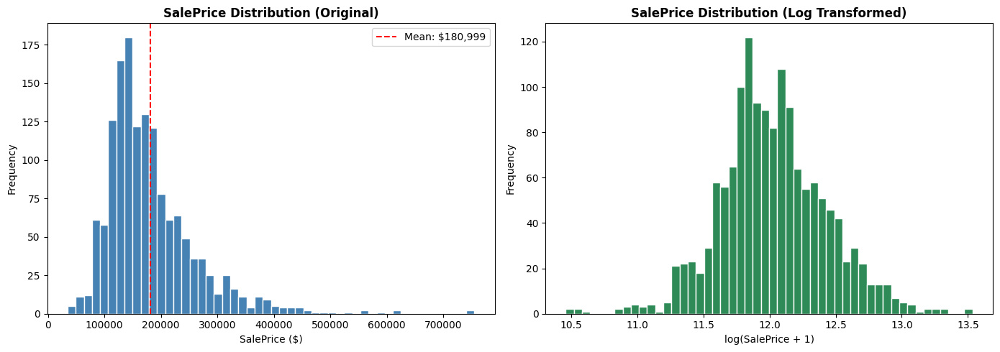
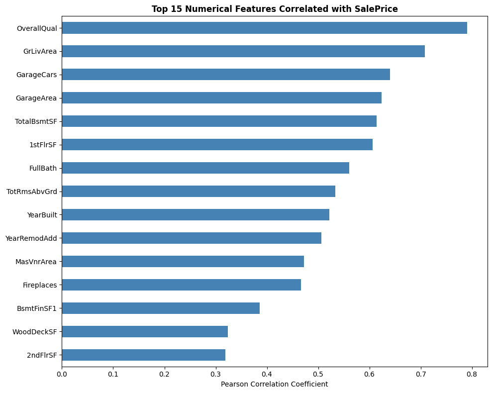
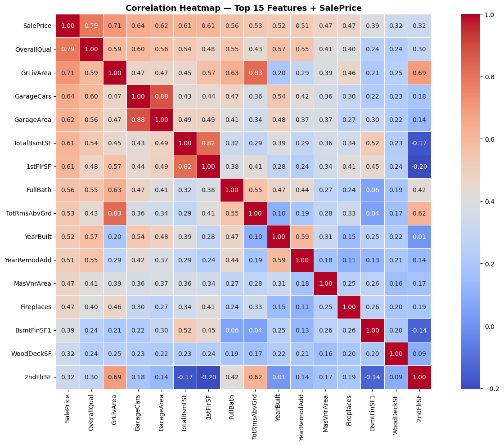
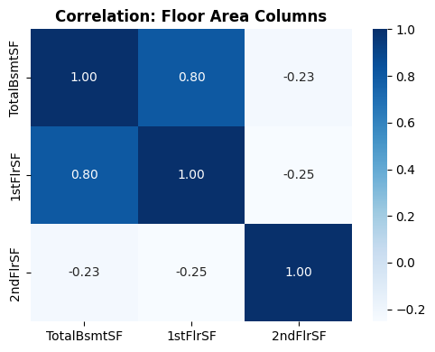
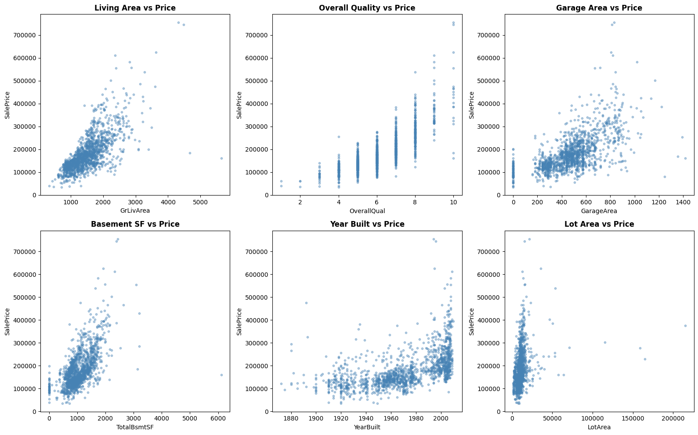
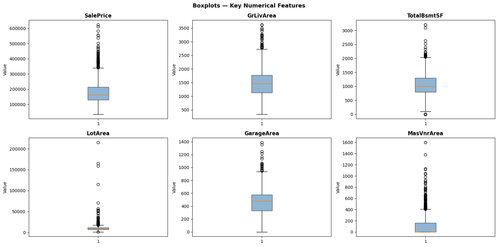
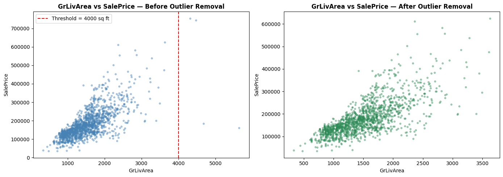

# 🏠 House Price Prediction System

<div align="center">


**End-to-end machine learning system for predicting residential property sale prices**

[Live Demo](#-running-locally) · [Notebook](notebooks/House_Price_Prediction_Final.ipynb) · [API Docs](#-api-reference)

</div>

---

---

## 📌 Project Summary

This project builds a complete ML pipeline that predicts house sale prices using the **Ames Housing Dataset** (1,460 records, 79 features). The final model — a tuned **CatBoost Regressor** — achieves **R² = 0.9265** on the test set with an RMSE of **$22,467**, outperforming Random Forest and XGBoost baselines.

The trained pipeline is deployed as a **FastAPI web application** with a clean, responsive frontend.

### Web Application Screenshots


---

## 📊 Exploratory Data Analysis

### Target Variable Distribution



### Feature Correlations





### Key Feature Relationships



### Distribution & Outliers




---

## 🏆 Model Performance

| Model                         | Test R²         | Train R²        | RMSE ($)          | Overfitting Gap |
| ----------------------------- | ---------------- | ---------------- | ----------------- | --------------- |
| Random Forest (baseline)      | 0.8565           | 0.9482           | $29,458           | 9.2%            |
| Random Forest (tuned)         | 0.8515           | 0.9755           | —                | 12.4%           |
| XGBoost (baseline)            | 0.8650           | 0.9950           | —                | 13.0%           |
| XGBoost (tuned)               | 0.8766           | 0.9765           | —                | 9.9%            |
| CatBoost (baseline)           | 0.9217           | —               | —                | —              |
| **CatBoost (final ✅)** | **0.9265** | **0.9532** | **$22,467** | **2.6%**  |

> **CV Mean R²:** 0.8983 · **CV Std:** 0.0077 (5-fold, highly stable)

**Why CatBoost won:** Native categorical feature encoding preserves information that one-hot encoding scatters across 112+ binary columns. Even the untuned CatBoost baseline (0.9217) outperformed the best-tuned XGBoost (0.8766) by 4.5 percentage points.

---

## 📁 Project Structure

```
HousePricePrediction/
│
├── house_price_app/              # Deployable web application
│   ├── main.py                   # FastAPI backend
│   ├── house_price_pipeline.py   # Custom sklearn transformer + CatBoost wrapper
│   ├── requirements.txt
│   ├── model/
│   │   └── house_price_pipeline_v2.joblib   ← trained pipeline (add manually)
│   ├── static/
│   │   ├── style.css
│   │   └── script.js
│   └── templates/
│       └── index.html
│
├── notebooks/
│   └── House_Price_Prediction_Final.ipynb   # Full EDA + modelling walkthrough
│
├── data/
│   └── data.csv                  # Ames Housing Dataset (add manually)
│
├── .gitignore
├── LICENSE
└── README.md
```

---

## 🔬 ML Pipeline

```
Raw CSV Input
     │
     ▼
HousePreprocessor (sklearn TransformerMixin)
  ├── Missing value imputation (domain-aware)
  ├── Feature engineering
  │     ├── TotalHouseQuality  = OverallQual × OverallCond
  │     ├── HouseAge           = YrSold − YearBuilt
  │     ├── TotalSF            = TotalBsmtSF + 1stFlrSF + 2ndFlrSF
  │     └── TotalBathrooms     = FullBath + 0.5×HalfBath + BsmtFullBath + 0.5×BsmtHalfBath
  └── Log transform on skewed numerical features
     │
     ▼
CatBoostWrapper
  └── CatBoostRegressor (native categorical encoding)
     │
     ▼
  np.expm1(prediction)  →  Predicted Sale Price ($)
```

---

## 🚀 Running Locally

### Prerequisites

- Python 3.9+
- pip

### 1. Clone the repository

```bash
git clone https://github.com/<your-username>/HousePricePrediction.git
cd HousePricePrediction
```

### 2. Install dependencies

```bash
cd house_price_app
pip install -r requirements.txt
```

### 3. Add the trained model

Place your `house_price_pipeline_v2.joblib` file inside `house_price_app/model/`:

```bash
cp /path/to/house_price_pipeline_v2.joblib house_price_app/model/
```

> **Note:** The `.joblib` file is excluded from the repo via `.gitignore` due to its binary size. Retrain using the notebook or request the file separately.

### 4. Start the server

```bash
cd house_price_app
uvicorn main:app --reload
```

Open your browser at → **[http://localhost:8000](http://localhost:8000)**

---

## 🔌 API Reference

### `GET /`

Serves the prediction UI (HTML).

### `POST /predict`

Accepts a JSON body with all house features and returns the predicted price.

**Example Request:**

```json
{
  "MSSubClass": 60,
  "MSZoning": "RL",
  "LotArea": 8450,
  "OverallQual": 7,
  "OverallCond": 5,
  "YearBuilt": 2003,
  "GrLivArea": 1710,
  "GarageCars": 2,
  "TotalBsmtSF": 856.0
}
```

**Example Response:**

```json
{
  "predicted_price": 208500.00
}
```

Interactive docs available at: **[http://localhost:8000/docs](http://localhost:8000/docs)**

---

## 📊 Dataset

**Ames Housing Dataset** — compiled by Dean De Cock for data science education.

| Property   | Value                                                                                   |
| ---------- | --------------------------------------------------------------------------------------- |
| Records    | 1,460 rows                                                                              |
| Features   | 79 (36 numerical, 43 categorical)                                                       |
| Target     | `SalePrice` in USD                                                                    |
| Year Range | 2006 – 2010                                                                            |
| Source     | [Kaggle Competition](https://www.kaggle.com/c/house-prices-advanced-regression-techniques) |

> `data.csv` is excluded from this repo. Download it from the Kaggle link above.

---

## 🧪 Reproducing Results

Open and run the notebook end-to-end:

```bash
cd notebooks
jupyter notebook House_Price_Prediction_Final.ipynb
```

The notebook covers:

1. Exploratory Data Analysis
2. Missing value analysis
3. Feature engineering
4. Skewness correction
5. Train-test split (no leakage)
6. Random Forest baseline + tuning
7. XGBoost baseline + tuning
8. CatBoost baseline + final tuning
9. Model comparison
10. Pipeline serialisation with `joblib`

---

## 🛠️ Tech Stack

| Layer         | Technology                      |
| ------------- | ------------------------------- |
| ML Model      | CatBoost Regressor              |
| Pipeline      | scikit-learn custom transformer |
| Backend       | FastAPI + Uvicorn               |
| Frontend      | HTML / CSS / Vanilla JS         |
| Templating    | Jinja2                          |
| Serialisation | joblib                          |

---

## 📄 License

This project is licensed under the MIT License — see [LICENSE](LICENSE) for details.

---

## 👤 Author

**Atharv Kathar**

[](https://github.com/<your-username>)
[](https://linkedin.com/in/<your-profile>)

> ⭐ If this project helped you, consider giving it a star! 
